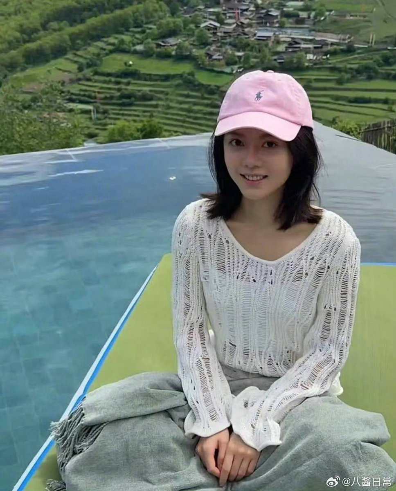
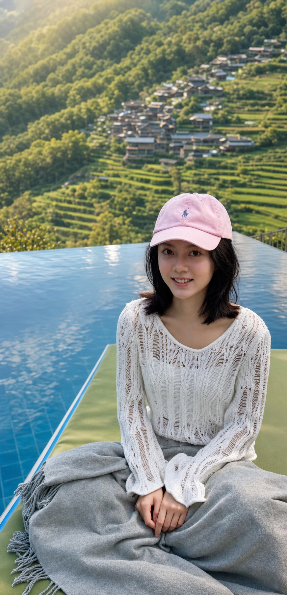
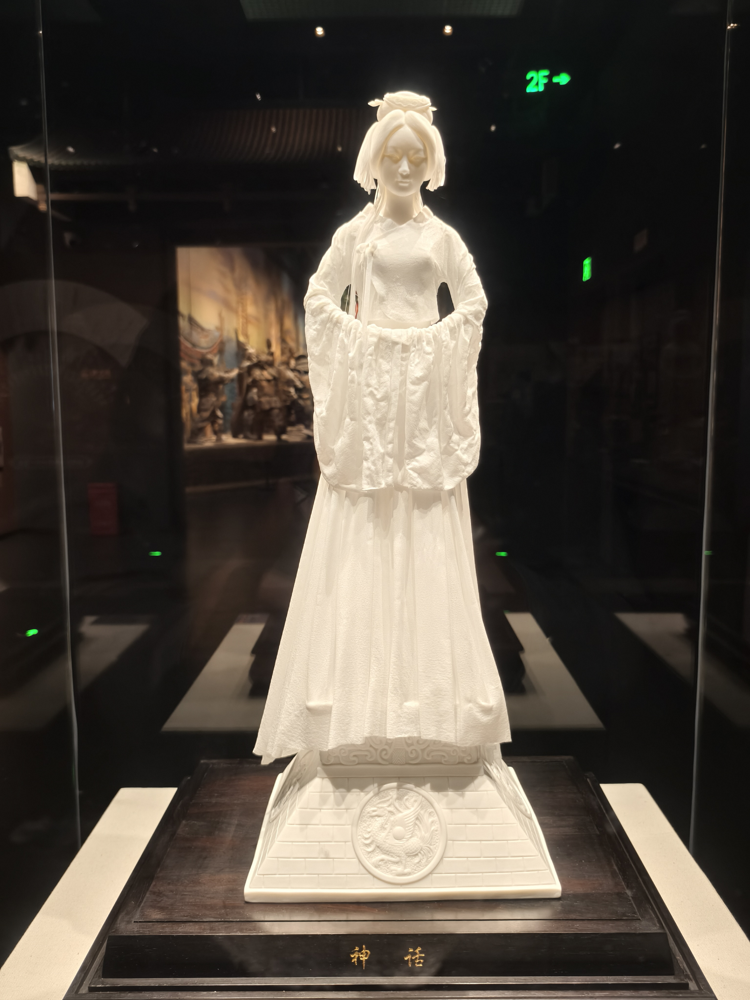
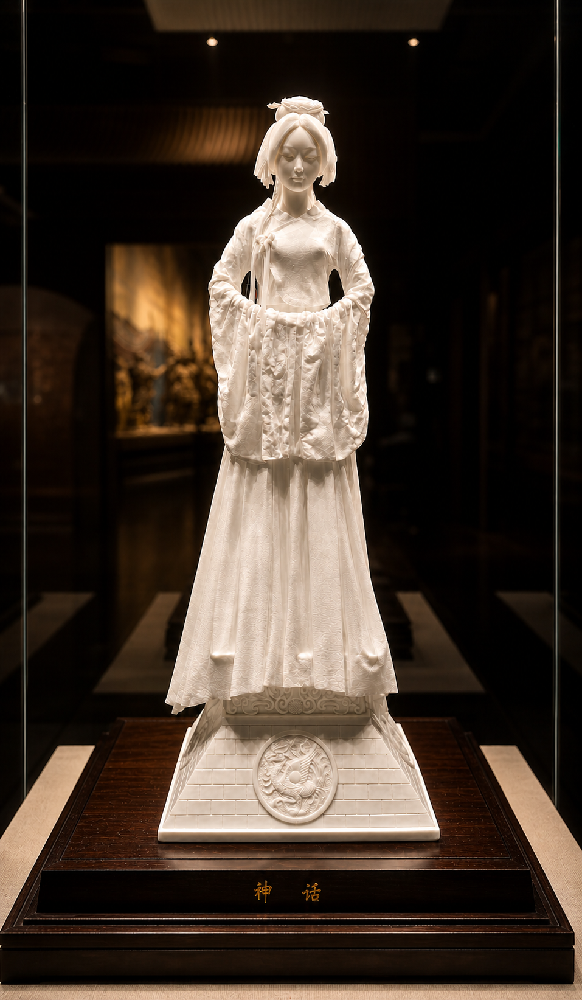

# Rescue Bad Photo

把废片修成可分享、可打印、可继续创作的照片增强技能。它会在保留主体身份、事实内容和重要细节的前提下，自动判断照片类型，完成曝光、色彩、光影、构图、修复和审美提升。

## 适用场景

- 拯救曝光差、偏色、发灰、噪点重、轻微模糊或构图失败的照片。
- 美化人像，同时保留身份、五官结构、皮肤质感、表情、服装和姿态。
- 增强风景、旅行、城市、山海、日落、天空等照片，让画面更震撼、更有氛围。
- 优化建筑、室内、展览、博物馆藏品、产品、食物、文档或艺术品照片。
- 修复老照片、褪色照片、黑白照片、扫描件、划痕、污渍或破损区域。
- 为社交分享、作品集、打印、归档或二次创作准备更完整的成片。

## 核心原则

- 保留硬锚点：人物身份、解剖结构、表情、姿态、服装、重要物体、文字、Logo、艺术品内容、文物事实、建筑身份、地标和核心场景布局。
- 放开软锚点：光线、氛围、色彩、天空、背景杂乱、裁切、构图、景深、局部对比、画面质感和最终成片风格。
- 先处理光影，再处理滤镜和颜色。好照片应该有明确的明暗层级，而不是单纯变亮或变艳。
- 默认做大师级裁切和重构图评估，不盲目保留原始手机构图。
- 美化版本必须明显更美。如果只是更干净但几乎没变化，就需要继续强化光影、构图、色彩、主体分离和氛围。

## 默认输出

除非用户明确要求其他数量，否则该技能默认交付四张清晰标注的结果：

| 标签 | 含义 |
| --- | --- |
| `program_natural` | 程序化自然版。忠实、干净、克制，但必须明显优于原图。 |
| `program_beauty` | 程序化美化版。更强调光影、色彩、构图、主体分离和高级成片感。 |
| `ai_natural` | AI 自然版。使用生成式修复、轻度补全、轻度重打光或背景优化，保持可信。 |
| `ai_beauty` | AI 美化版。最具冲击力，允许更大胆地改善光线、氛围、天空、背景、构图和镜头感。 |

最终回复还应包含 `AI natural prompt used:` 和 `AI beauty prompt used:`，方便用户复用或调整生成提示词。

## 自动工作流

当用户只上传照片并调用技能时，不需要追问偏好。技能会自动：

1. 判断照片类型：人像、风景、建筑、展览、产品、文档、老照片或混合场景。
2. 选择对应的修复和美化策略。
3. 确定审美方向，例如自然干净、暖调胶片、戏剧化电影感、商业质感、纪实端正或极简安静。
4. 先做程序化自然修复，再做程序化审美增强。
5. 为 AI 版本构建保留硬锚点、放开软锚点的提示词。
6. 对所有版本进行构图、光影、色彩、细节和缩略图冲击力检查。
7. 只交付四个成片，不默认输出原图、中间图、拼图或对比图。

## 目录结构

```text
rescue-bad-photo/
  SKILL.md
  README.md
  photos/
    1.jpg
    1_ai_beauty.png
    2.jpg
    2_ai_beauty.png
    3.jpg
    3_ai_beauty.png
  agents/
    openai.yaml
  references/
    photo-rescue-guide.md
    photographic-style-playbook.md
```

## 效果对比

以下示例展示原图与使用技能后的 `ai_beauty` 美化效果对比。

<table width="100%">
  <tr>
    <th width="50%">原图</th>
    <th width="50%">AI 美化版</th>
  </tr>
  <tr>
    <td width="50%"></td>
    <td width="50%"></td>
  </tr>
  <tr>
    <td width="50%"></td>
    <td width="50%"></td>
  </tr>
  <tr>
    <td width="50%"></td>
    <td width="50%"></td>
  </tr>
</table>

## 关键参考文件

- `SKILL.md`：技能主说明，包含触发条件、核心规则、默认工作流和输出标准。
- `references/photo-rescue-guide.md`：照片诊断、修复配方、四版本输出流程、构图评估和质量检查。
- `references/photographic-style-playbook.md`：摄影级审美语言、光影与构图原则、不同题材的风格方向和生成提示词写法。
- `agents/openai.yaml`：OpenAI Agent 展示名、简介和默认调用提示。

## 使用方式

上传一张照片，并使用类似指令：

```text
Use $rescue-bad-photo on this uploaded photo.
```

也可以用中文表达：

```text
帮我用 rescue-bad-photo 拯救这张废片。
```

如果有明确目标，可以直接说明：

```text
把这张风景照修得更震撼，但保留真实地貌和视角。
```

```text
修复这张老照片，尽量自然，可以适度上色。
```

```text
优化这张博物馆展品照片，保留材质和标签内容，背景可以虚化。
```

## 注意事项

- 不要把原图作为默认交付物；原图只作为内部参考。
- 不要为了“保真”而保留糟糕光线、弱构图、杂乱背景或手机随手拍的扁平质感。
- 不要改变人物身份、建筑事实、文物细节、可读文字、Logo、产品设计或艺术品内容。
- 对文档、艺术品、博物馆展品和证据类照片，应优先保持可信和准确。
- 对风景、旅行和非严格纪实照片，默认美化版本应更有氛围、更有尺度感、更像摄影成片。
